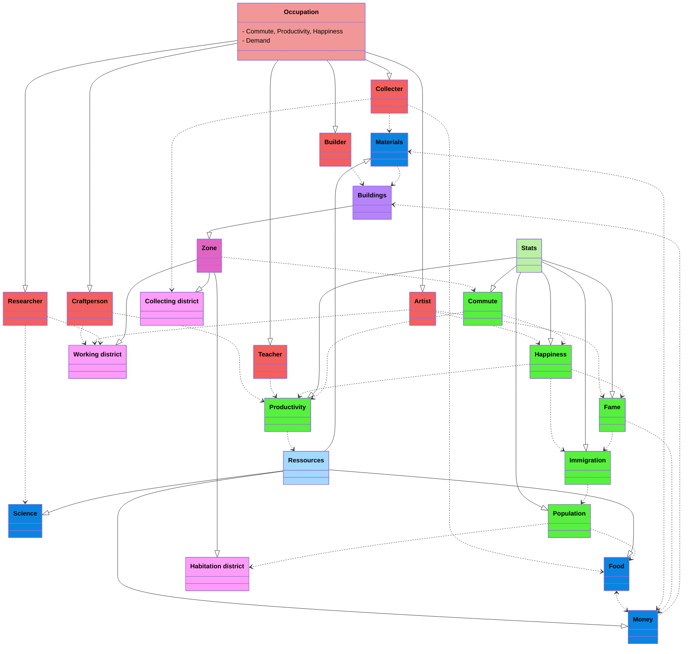

# Sim 
Kindof a perfect world. No crime, no war, no violence of any kind. Natural disasters are optional. 

A lot of factors influence each other :
- Inhabitants are split into age groups and occupations (no social class don't wanna go into that)
- There is a demand, and number of ppl, for each occupation. 
- Each occupation brings perks to the city
- Demand is driven by player actions, and various macro factors

Goal : simplified system centered around occupation and buildings.

## Occupations 
- Collecter : handles all ressource exploitation. Food from crops and fishing, Materials from forests and mines. Demand driven by food demand, and raw material demand.
- Craftman : Refines raw materials into refined materials. Demand driven by material demand (inverse of the stock).
- Builder : Accelerates the construction of buildings, and prevent malfunctions. Demand driven by number of buildings in construction. Some buildings have additional upkeep requirements.
- Resarcher : Accelerates the research rate. Demand driven by idleness. 
- Teacher : Demand driven by amount of birth. Increase the effectiveness of the workforce. 
- optional : Emergency services : Reduces impact of catastrophes. Driven by catastrophes. 
- Artist : Increase happiness, and immigration (immigration is good). Demand driven by low happiness or idleness.

Money is only available through trading (no specific taxes)
All ressources except happiness can be traded for money.
Everyone consumes food. Buildings require specific materials, that can be replaced by money. 
The population has an efficiency parameter, determined by happiness and education. 

Demand drives immigration, and, to a lesser factor, occupation choosen by new inhabitants. 
New inhabitants can also be steered towards a specific occupation.

## Buildings
Specific buildings can increase the demand for occupation, and give efficiency bonuses. (University increases research and teaching, etc)

Zones are necessary for some professions : 
- Collecting district for collecters (farms, fisheries, etc)
- Working district for everyone but collecters, builders and teachers.
- Habitation districts for everyone

No "commercial district" or "industrial district", we're making smart towns.

## Ammenities
Ammenities are a thing. They generally require upkeep in the form of builders. 
- electricity 
- water
- waste disposal

All of this is required or happiness go down, and some buildings stop working. 

## Transportation
Inhabitants have an occupation, a home, and occasionally go to amusement centers (parks, art workshops)
They need a way to move from one place to another. Cars are very nerfed but an option.

Simulation is basically done by : 
- each inhabitant compute the shortests paths to their destinations and chose one at random, then increase the occupation.
- When transports are overloaded, they get slower (with different degree of getting slower)

## Ressources
There are some "money" resources, that are basically materials and money. They are mostly required to expand.

Food can be stored, but degrades. It has an upkeep. 

Happiness and research are not stored, but contribute to other factors : research gives research points to unlock stuff
and happiness does a lot of stuff. 

## Migrations 
Ppl of each occupation have a migration proportion, driven by current demand, demand from other cities (relative to distance), current happiness, and happiness from other cities (relative to distance)

# Implem
Use a scripting language for implem details (easier prototyping, etc).

Whats the best way to go about it ? 

Classes -> Rust structs, stored in a map
each class map has a .add_new_`class`() method that adds a new instance (like a new occupation) with the right arguments

It also returns an opaque handle (just an integer under the hood)

Then you can add links between objects using their handle (handles are accessible by name as well)
- simple links add_simple_`class1`_`class2`(object1_handle, object2_handle, field2, delta) : specify a source and dest objects, and a dest field. It adds object1 * delta to the field2 growth rate. Delta is an array. Optimized using a matmul.
- (advanced links add_advanced_`class1`_`class2` : specify source and dest objects, and a function fields of source -> fields of dest )

Available in classes : stats, which are computed from the other objects.
